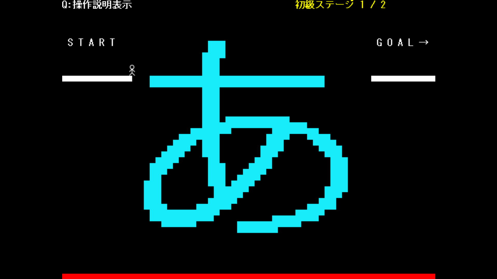

# ワードビルダー

## プレイ動画

https://youtu.be/9qXjgqchy3g

## 実行方法

1. Buildフォルダからzipファイルをダウンロード
2. zipファイルを解凍
3. 実行ファイル.exeを実行

※Windows環境で動作確認済み

## 使用技術

* C++
* DXライブラリ

## 制作形態

個人制作

## ゲーム概要
文字を入力することで道を作り、スタート地点からゴール地点を目指す2Dアクションゲームです。

入力できる文字は全角文字1文字分の幅で、半角なら2文字入力できることもあります。

作成した文字ブロックは既存ブロックを破壊でき、この性質を利用しないとクリアできないコースも存在します。

初級、中級、上級ステージに分かれていて、ステージが進むごとにギミックが増えます。
例えば、

- 中級では壊せない壁
- 上級では文字入力に回数制限

などがあります。

## 操作方法：
### 【キーボード】
- 左右キー：移動　　
- Zキー：ジャンプ
- Xキー：文字入力の画面に移行

### 【ゲームパッド】
- 十字ボタン：移動
- Aボタン：ジャンプ
- Xボタン：文字入力の画面に移行

## 工夫した点：
本作品で最も工夫した点は入力した文字の形状を足場をそのまま足場として生成する処理です。
具体的には、

1. 入力した文字を30ピクセル程度の大きさで描画
2. 画像を1ピクセルごとに走査
3. 白黒判定結果に対応した二次元配列を作成
4. 配列情報から足場生成
5. 描画した文字画像を消去

という処理を1フレーム内で行うことで違和感なく実装することに成功しました。
